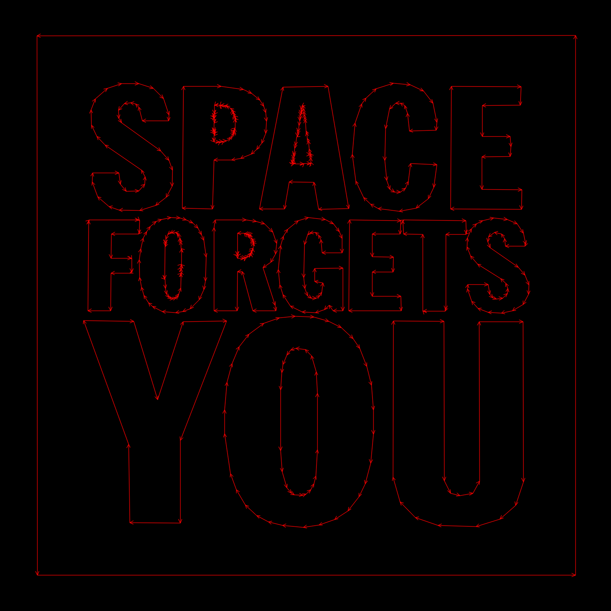
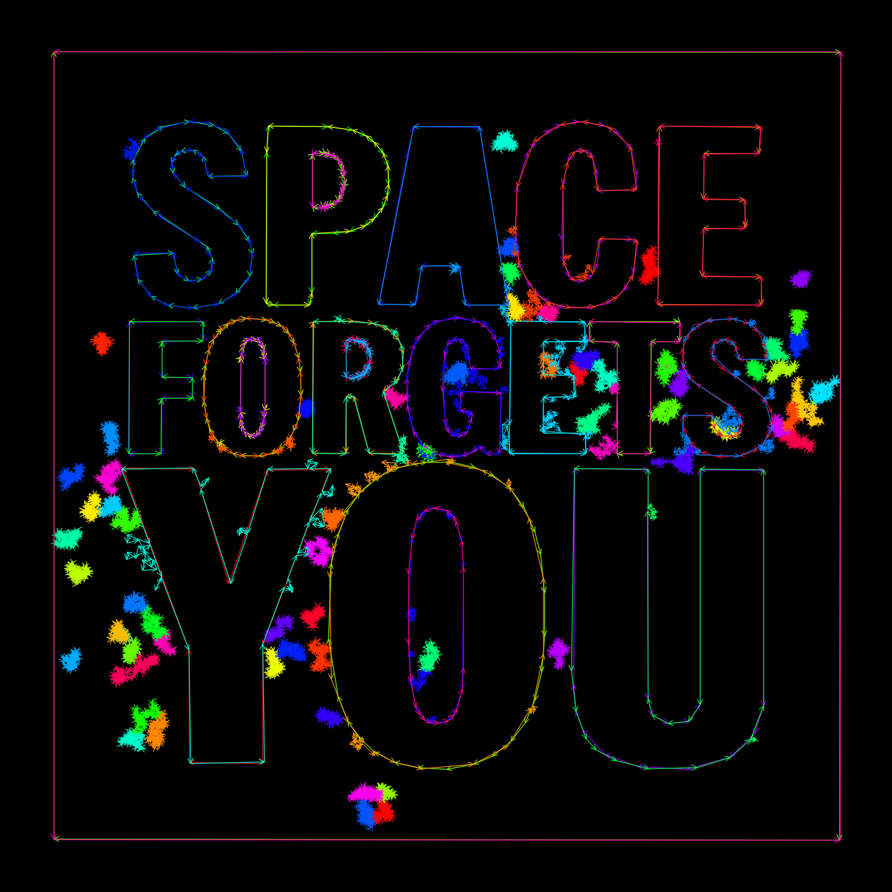

# contour2vec

Image-to-vector pipeline for RP2040 drawing applications. Converts raster images into polyline paths expressed in a fixed 16 384 × 16 384 coordinate space, then optionally renders a preview with directional arrows to visualise drawing order and path density.

## How it works

```
image  →  extract_contours.py  →  vect/*.txt  →  preview_vectors.py  →  preview/*.png
```

1. **extract_contours.py** — thresholds the image (Otsu or Canny), finds contours, simplifies them with Douglas-Peucker, and scales the result to the 0 – 16 383 integer grid.
2. **preview_vectors.py** — reads the `.txt` vector file and renders each segment as an arrow so direction and drawing order are immediately visible.
3. **run.sh** — convenience wrapper that runs both steps in sequence and opens the preview.

## Requirements

- Python 3.x with `opencv-python` and `numpy` (installed in the project `.venv`)
- macOS / Linux (the `open` call in `run.sh` is macOS; replace with `xdg-open` on Linux)

```
python3 -m venv .venv
source .venv/bin/activate
pip install opencv-python numpy
```

## Usage

```
./run.sh <image_path> [option=value ...]
```

| Option | Default | Description |
|---|---|---|
| `color` | `red` | Line color: `red`, `green`, `white`, `fuchsia`, `orange`, `rainbow` |
| `size` | `1200` | Minimum side of the preview in pixels |
| `minarea` | `100` | Minimum contour area in pixels (filters noise) |
| `epsilon` | `0.002` | Douglas-Peucker tolerance (fraction of perimeter) |
| `mode` | `otsu` | Threshold mode: `otsu` or `canny` |
| `mode=canny,canny_low=N` | `50` | Canny lower threshold |
| `mode=canny,canny_hi=N` | `150` | Canny upper threshold |

## Vector file format

```
# <orig_width> <orig_height>
[x0,y0 ,x1,y1 ,... ,x0,y0 ]
[x0,y0 ,x1,y1 ,... ,x0,y0 ]
```

- First line: original image dimensions (used by the preview renderer)
- Each subsequent line: one closed polyline; coordinates are integers in 0 – 16 383
- The last point of each path repeats the first to close the loop

## Example — space image

Source: [`img/space.jpg`](img/space.jpg)

### Otsu mode — `./run.sh img/space.jpg color=red`

21 paths, 541 vectors



### Canny mode — `./run.sh img/space.jpg mode=canny,canny_low=30,canny_hi=100 color=rainbow`

106 paths, 9 399 vectors



Vector file (otsu, final): [`vect/space.txt`](vect/space.txt)

## License

- **Code:** GPL-3.0-or-later
- **Example images** (`img/space.jpg`): all rights reserved — included for demonstration only

## Author

ghedo (luca.ghedini@gmail.com) — 2026

Built with [Claude Code](https://claude.ai/claude-code) by Anthropic.

## Development effort

This project was developed entirely through a conversation with Claude Code.

- **First session:** 2026-05-09
- **Last session:** 2026-05-10
- **Sessions:** 2
- **Active conversation time: ~60 minutes**

*How active time is computed:* consecutive message timestamps are diffed; gaps ≤ 5 minutes are summed; longer gaps (breaks, hardware testing) are discarded.

### Tokens

| Metric | Tokens |
|---|---:|
| Input (non-cache) | — |
| Output | — |
| Cache write | — |
| Cache read | — |
| **Total** | **~TBD** |

*(Token counts will be filled from the session transcripts at `~/.claude/projects/.../*/jsonl`.)*
